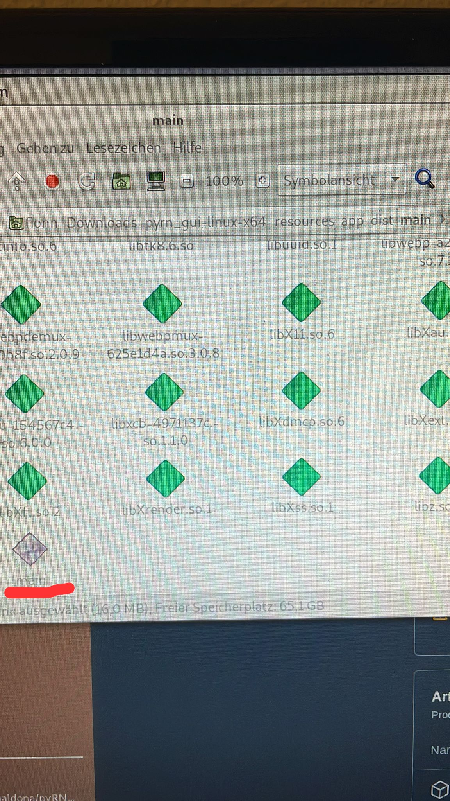
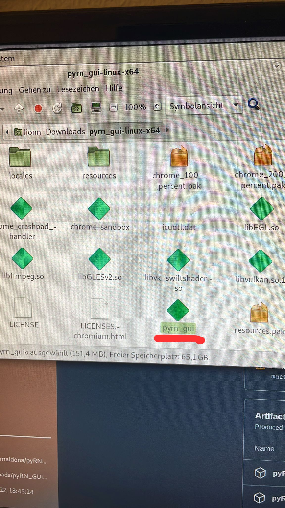
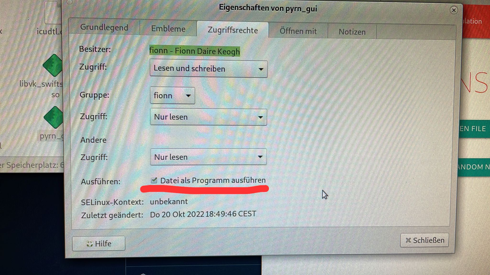

# Download

Download the newest release of the pyRN-UI from the release page of the [Github repository](https://github.com/pmaldona/pyRN/releases).

There should be binaries for Linux, Mac OS (Darwin) and Windows.

## Usage on Linux
Currently one needs to modify two files in order to run the binary files.
From the root of the binary folder change permissions of the following two files:
- ./pyrn_gui
- ./resources/app/dist/main/main

Set both as executable file.

